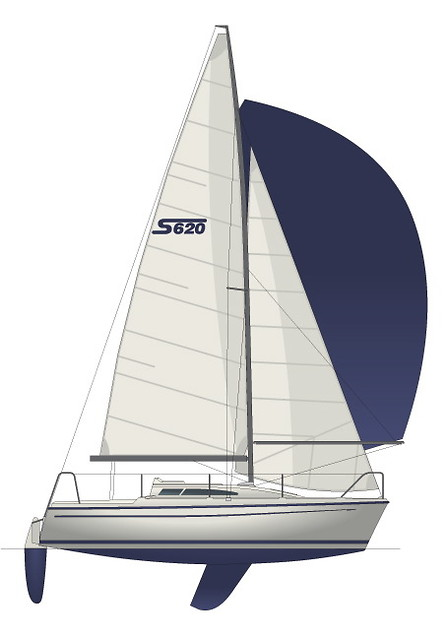

# Introduction

Welcome to the _Istio_ handbook.

This document cover both the systems and procedures as used aboard _Istio_.

## Facts and figures

_Istio_ is an [Sasanka 620](https://sailboatdata.com/sailboat/sasanka-620), a 21ft light sailboat built in Poland in 1994. The designer of this boat is Mr. Andrzej Skrzat and main purpose of this boat is lake and river tourism.

- Length: 21ft
- Beam: 2.4m
- Draft: 0.3m
- Displacement: 1200kg
- Ballast: 200kg
- Hull speed: 5.4kt loaded, 6.1kt empty

